# Example state machine diagrams

These diagrams are rendered from the models in [`../../../examples/`](../../../examples)
with the [`rfsm.plantuml`](../../../README.md#rfsmplantuml-plantuml-state-diagram-export)
exporter. Regenerate them with:

```sh
tools/rfsm2plantuml examples/<model>.lua   # writes a .puml next to the model
plantuml -tpng <model>.puml                # render to png
```

## Basics

| Model | Diagram |
|-------|---------|
| [`hello_world.lua`](../../../examples/hello_world.lua) | 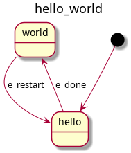 |
| [`simple.lua`](../../../examples/simple.lua) | 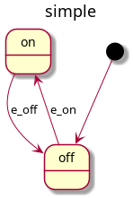 |
| [`introductory.lua`](../../../examples/introductory.lua) | 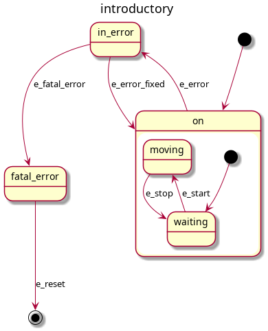 |
| [`simple_doo_idle.lua`](../../../examples/simple_doo_idle.lua) | 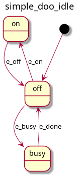 |
| [`simple_idle_doo.lua`](../../../examples/simple_idle_doo.lua) | 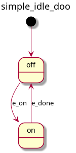 |

## Connectors

| Model | Diagram |
|-------|---------|
| [`connector_simple.lua`](../../../examples/connector_simple.lua) | 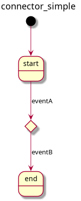 |
| [`connector_split.lua`](../../../examples/connector_split.lua) | 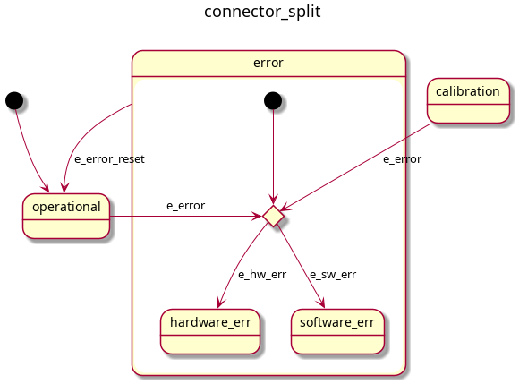 |
| [`connector_cycles.lua`](../../../examples/connector_cycles.lua) | 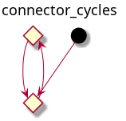 |
| [`connector_cycles2.lua`](../../../examples/connector_cycles2.lua) | 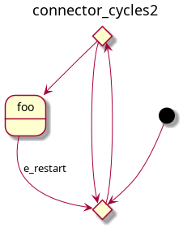 |

## Composite & nested states

| Model | Diagram |
|-------|---------|
| [`composite_nested.lua`](../../../examples/composite_nested.lua) | 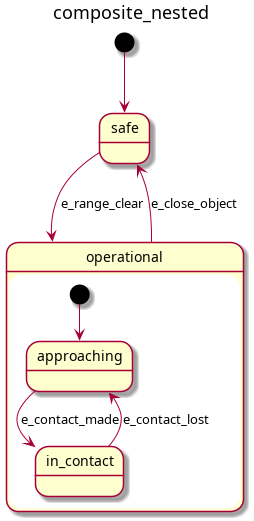 |
| [`composite_exitconn.lua`](../../../examples/composite_exitconn.lua) | 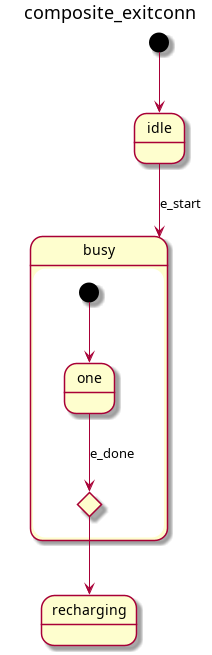 |
| [`relative_trans.lua`](../../../examples/relative_trans.lua) | 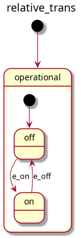 |
| [`subgraphs.lua`](../../../examples/subgraphs.lua) | 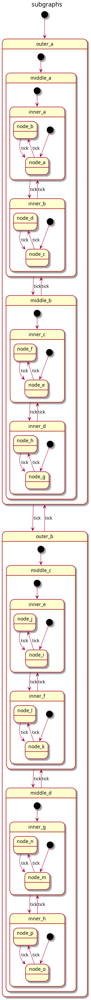 |

## Extensions & misc

| Model | Diagram |
|-------|---------|
| [`emem_test.lua`](../../../examples/emem_test.lua) | 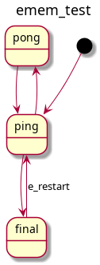 |
| [`monitor_state.lua`](../../../examples/monitor_state.lua) | 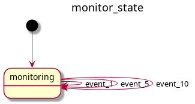 |
| [`timeevent.lua`](../../../examples/timeevent.lua) | 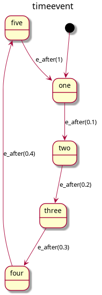 |
| [`preview_example.lua`](../../../examples/preview_example.lua) | 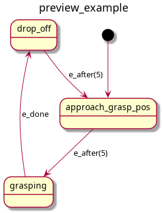 |
| [`preview_example2.lua`](../../../examples/preview_example2.lua) | 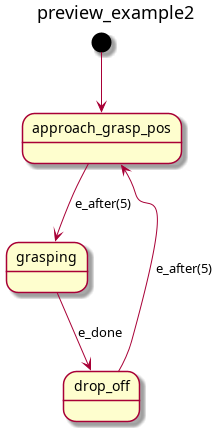 |
| [`total_failure.lua`](../../../examples/total_failure.lua) | 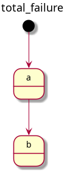 |
| [`ball_tracker.lua`](../../../examples/ball_tracker.lua) | 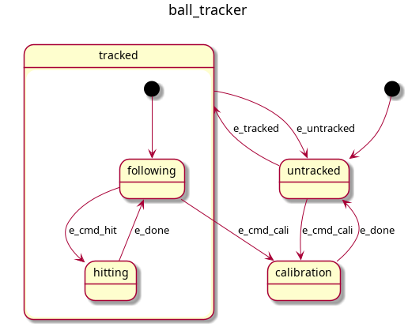 |
| [`ball_tracker_scope.lua`](../../../examples/ball_tracker_scope.lua) | 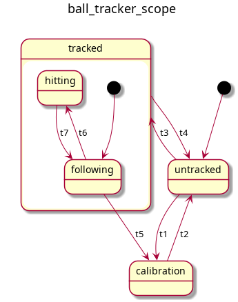 |
